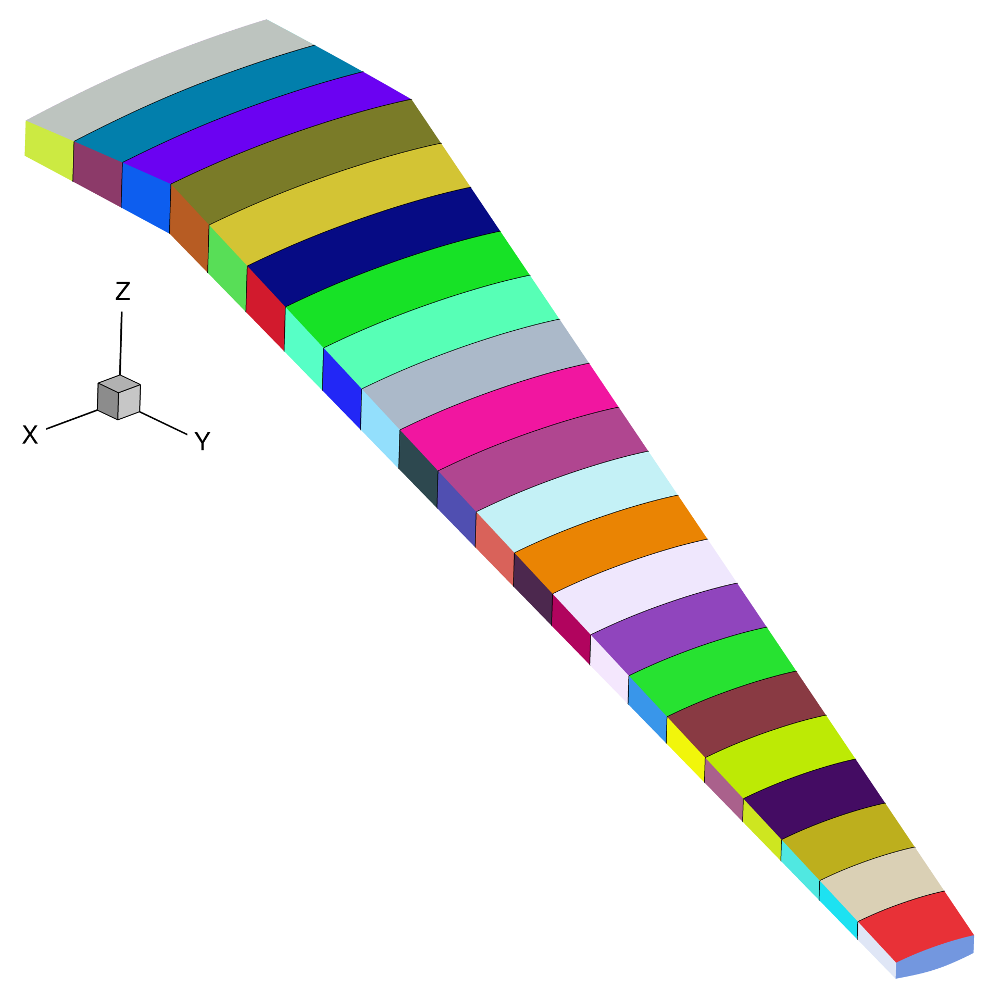

Aeroelastic Optimization Benchmark
==================================

This document describes the benchmark model and optimization problems to be used by working group 1 for the special session on High-Fidelity Aeroelastic Design Optimization Applications and Benchmarks at the 2025 AIAA SciTech Forum.
These were first proposed in our paper at the 2024 AIAA SciTech Forum :cite:t:`AGray2024a`.
This document contains the model and problem description sections of that paper, with some small changes.
It should be considered the up to date reference for those planning to take part in the special session.

Wing Model 
----------

The benchmark model is based on an OML geometry originally defined by :cite:t:`Kenway2013`, who referred to it is as the STW.
In this document we simply refer to it as `the wing` or `the benchmark model`.

Wing Geometry
-------------

The wing geometry is shown in :numref:`figWingPlanform`, :numref:`figBoundaryConditions` and :numref:`figAirfoilSection`.
It has a simple trapezoidal planform, based on the Boeing 717, with a constant, untwisted RAE2822 cross-section, shown in :numref:`figAirfoilSection`.
Note that this cross section cuts through the wing on planes normal to the global Y-axis, rather than normal the quarter-chord axis.
The cross section extends out to the nominal semispan of :math:`14m`, beyond which a small rounded tip cap extends a further :math:`42.5mm`.

The wing contains a conformal wingbox with upper and lower skins, leading and trailing edge spars, and 23 ribs.
The wingbox features a typical SOB break at a semispan of :math:`y = 1.5m`, inboard of which the wingbox is unswept, resembling a center-box.
Outboard of the SOB, the wingbox extends from 15 to 65% of the chord.
Four of the ribs are evenly spaced between the centerline and the SOB, the remaining ribs are evenly spaced between the SOB and the tip.
The wingbox is subject to symmetry conditions at the centerline and is fixed in the chordwise and vertical directions at the SOB as shown in :numref:`figBoundaryConditions`.

CAD files of both the wing OML and wingbox geometries are provided in the repository.

.. figure:: figures/SimpleTransonicWing/wingPlanform.png
   :name: figWingPlanform
   :alt: Wing Planform
   :align: center

   Wing Planform

.. figure:: figures/SimpleTransonicWing/BoundaryConditions.png
   :name: figBoundaryConditions
   :alt: Wing BCs
   :align: center

   Wing OML and wingbox, boundary conditions are applied to the wingbox at the side-of-body junction and symmetry plane

.. figure:: figures/SimpleTransonicWing/AirfoilSection.png
   :name: figAirfoilSection
   :alt: RAE2822 airfoil section
   :align: center

   RAE2822 airfoil section

.. \begin{figure}[ht!]
..   \centering
..   \begin{subfigure}{0.49\textwidth}
..     \centering
..     \includegraphics[width=0.99\textwidth]{SimpleTransonicWing/wingPlanform}
..     \captionsetup{width=0.9\linewidth}
..     \caption{Wing planform}
..     \label{fig:wingPlanform}
..   \end{subfigure}
..   \begin{subfigure}{0.49\textwidth}
..     \centering
..     \includegraphics[width=0.99\textwidth]{SimpleTransonicWing/BoundaryConditions}
..     \captionsetup{width=0.9\linewidth}
..     \caption{Wing OML and wingbox, boundary conditions are applied to the wingbox at the side-of-body junction and symmetry plane}
..     \label{fig:BoundaryConditions}
..   \end{subfigure}
..   \begin{subfigure}{0.8\textwidth}
..     \centering
..     \includegraphics[width=0.99\textwidth]{SimpleTransonicWing/AirfoilSection}
..     \captionsetup{width=0.9\linewidth}
..     \caption{RAE2822 airfoil section}
..     \label{fig:AirfoilSection}
..   \end{subfigure}
..   \caption{OML and wingbox geometries.}
..   \label{fig:SimpleTransonicWing}
.. \end{figure}

Aerodynamic Model 
-----------------

A family of 3 structured multiblock CFD meshes for the wing are provided in the repository, which are summarized in :numref:`tabAeroMeshes`.
The finest mesh (L1) is intended only for mesh convergence and analysis studies, the L2 mesh is intended for final optimizations, and the L3 mesh for debugging.
The coarser meshes are created by repeatedly coarsening the L0 surface mesh by a factor of 2 in each direction before extruding up to a distance of :math:`300m` from the wing surface.
The advantage of this approach is that it results in higher quality volume meshes than simply coarsening the L1 volume mesh.
The disadvantage is that it does not provide the parametrically-similar series of grids necessary for a mathematically rigorous convergence study :cite:p:`Vassberg2011a`.

Use of these meshes is not required.
Participants are encouraged to submit results using meshes with topologies and sizes that are suitable for their CFD codes and available computational resources.

.. \input{\tablepath/AeroMeshes.tex}

.. table:: CFD mesh information.
   :name: tabAeroMeshes

   +-----------+--------------------------+---------------------------+----------------------------------+
   | **Mesh**  | **Cells**                | **First cell height (m)** |  **Target cruise** :math:`y^{+}` |
   +===========+==========================+===========================+==================================+
   | L1        | :math:`7.8 \times 10^6`  | :math:`3 \times 10^{-6}`  | 0.125-0.25                       |
   +-----------+--------------------------+---------------------------+----------------------------------+
   | L2        | :math:`9.7 \times 10^5`  | :math:`6 \times 10^{-6}`  | 0.25-0.5                         |
   +-----------+--------------------------+---------------------------+----------------------------------+
   | L3        | :math:`1.8 \times 10^5`  | :math:`1.2 \times 10^{-5}`| 0.5-1                            |
   +-----------+--------------------------+---------------------------+----------------------------------+

.. \begin{figure}[ht!]
..   \begin{subfigure}{0.49\textwidth}
..     \centering
..     \includegraphics[width=0.99\textwidth]{AeroMeshes/L1Mesh}
..     \caption{L1, 7.8m cells}
..   \end{subfigure}
..   \begin{subfigure}{0.49\textwidth}
..     \centering
..     \includegraphics[width=0.99\textwidth]{AeroMeshes/L2Mesh}
..     \caption{L2, 1.0m cells}
..   \end{subfigure}
..   \begin{subfigure}{0.49\textwidth}
..     \centering
..     \includegraphics[width=0.99\textwidth]{AeroMeshes/L1Mesh-TipLE}
..     \caption{L1, wing-tip leading edge}
..   \end{subfigure}
..   \begin{subfigure}{0.49\textwidth}
..     \centering
..     \includegraphics[width=0.99\textwidth]{AeroMeshes/L2Mesh-TipLE}
..     \caption{L2, wing-tip leading edge}
..   \end{subfigure}
..   \begin{subfigure}{0.49\textwidth}
..     \centering
..     \includegraphics[width=0.99\textwidth]{AeroMeshes/L1Mesh-TipTE}
..     \caption{L1, wing-tip trailing edge}
..   \end{subfigure}
..   \begin{subfigure}{0.49\textwidth}
..     \centering
..     \includegraphics[width=0.99\textwidth]{AeroMeshes/L2Mesh-TipTE}
..     \caption{L2, wing-tip trailing edge}
..   \end{subfigure}
..   \caption{Structured multiblock \gls{cfd} meshes provided for the benchmark model.}
..   \label{fig:AeroMeshes}
.. \end{figure}

Structural Model
----------------

A series of shell FE meshes of the wingbox are also provided in the repository in BDF format.
These are summarized in :numref:`tabStructMeshes` and consist of 4-node quad elements.
Equivalent meshes with higher order 9 and 16-node quad elements are also available in the repository however, these element types are not widely supported by commercial FE codes.

.. \input{\tablepath/StructMeshes.tex}

.. table:: FE mesh information.
   :name: tabStructMeshes

   +-------------+----------------------------+----------------------------+----------------------------+--------------------+---------------+
   | - **Mesh**  |  **Elements between ribs** | **Elements between spars** | **Elements between skins** | **Total Elements** | **Total DOF** |
   +=============+============================+============================+============================+====================+===============+
   | L1          | 20                         | 40                         | 20                         | 71,200             | 419,778       |
   +-------------+----------------------------+----------------------------+----------------------------+--------------------+---------------+
   | L2          | 10                         | 20                         | 10                         | 17,800             | 103,158       |
   +-------------+----------------------------+----------------------------+----------------------------+--------------------+---------------+
   | L3          | 5                          | 10                         | 5                          | 4,450              | 24,948        |
   +-------------+----------------------------+----------------------------+----------------------------+--------------------+---------------+
   | L4          | 3                          | 5                          | 3                          | 1,401              | 7,536         |
   +-------------+----------------------------+----------------------------+----------------------------+--------------------+---------------+

.. figure:: figures/StructMeshes/L1StructMesh.png
   :name: figStructMesh
   :alt: Structural mesh
   :align: center

   The finest wingbox mesh contains 71,200 quadrilateral elements and 419,778 DOF.

To test the modeling capabilities relevant for analysis of modern aircraft structures, the wingbox is assumed to be made of stiffened composite panels.
The stiffeners are assumed to have a T-shaped cross section, as shown in :numref:`figCrossSection`.
The composite ply properties used throughout the wingbox are shown in :numref:`tabCompositeProperties`, taken from :cite:t:`Brooks2020a`.
Both the shell and stiffeners in every panel of the wingbox are assumed to consist of a [0, -45, +45, 90]\si{\degree} layup.
Different layups of these plies are used for different components in the wingbox based on values used by :cite:t:`Dillinger2014`.
In the upper and lower skin shells and in all stiffeners, we assume a \SI{0}{\degree} biased layup with ply fractions of [44.41%, 22.2%, 22.2%, 11.19%], while in the spar and rib shells we use a more isotropic [10\%, 35\%, 35\%, 20\%].
In the skins, the stiffeners and \SI{0}{\degree} plies are aligned with the trailing edge spar, in the spars and ribs they are vertically oriented.

.. figure:: figures/StiffenedShellModel/CrossSection.png
   :name: figCrossSection
   :align: center

   Cross section of the panel

There are a wide variety of approaches to modeling stiffened shells in FE models and predicting their failure, particularly in the context of optimization.
We therefore do not believe it is practical to enforce a single approach.
However, the models used by participants should:

1. Be able to model the anisotropic composite laminate properties given above.
2. Be able to model the presence of panel stiffeners and, ideally, be able to parameterize their cross-section.
3. Use sufficient failure criteria to constrain that the structure has a safety factor of at least 1.5 to both material and buckling failure.

.. \input{\tablepath/CompositeProperties.tex}

.. table:: Composite ply properties.
   :name: tabCompositeProperties

   +---------------------+-----------------------------------------+-----------------------------------+
   | **Property**        | **Description**                         |    **Value**                      |
   +=====================+=========================================+===================================+
   | :math:`E_{11}`      | Fiber direction modulus                 |  :math:`117.7\,\text{GPa}`        |
   +---------------------+-----------------------------------------+-----------------------------------+
   | :math:`E_{22}`      | Transverse modulus                      | :math:`9.7\,\text{GPa}`           |
   +---------------------+-----------------------------------------+-----------------------------------+
   | :math:`G_{12}`      | In-plane shear modulus                  | :math:`4.8\,\text{GPa}`           |
   +---------------------+-----------------------------------------+-----------------------------------+
   | :math:`G_{13}`      | Transverse shear modulus                | :math:`4.8\,\text{GPa}`           |
   +---------------------+-----------------------------------------+-----------------------------------+
   | :math:`G_{23}`      | Transverse shear modulus                | :math:`4.8\,\text{GPa}`           |
   +---------------------+-----------------------------------------+-----------------------------------+
   | :math:`T_{1}`       | Fiber direction tensile strength        | :math:`1648\,\text{MPa}`          |
   +---------------------+-----------------------------------------+-----------------------------------+
   | :math:`C_{1}`       | Fiber direction compressive strength    | :math:`1034\,\text{MPa}`          |
   +---------------------+-----------------------------------------+-----------------------------------+
   | :math:`T_{2}`       | Transverse tensile strength             | :math:`64\,\text{MPa}`            |
   +---------------------+-----------------------------------------+-----------------------------------+
   | :math:`C_{2}`       | Transverse compressive strength         | :math:`228\,\text{MPa}`           |
   +---------------------+-----------------------------------------+-----------------------------------+
   | :math:`S_{12}`      | Shear strength                          | :math:`71\,\text{MPa}`            |
   +---------------------+-----------------------------------------+-----------------------------------+
   | :math:`\nu_{12}`    | Major Poisson’s ratio                   | :math:`0.35`                      |
   +---------------------+-----------------------------------------+-----------------------------------+
   | :math:`\rho`        | Density                                 | :math:`1550\,\text{kg}/\text{m}^3`|
   +---------------------+-----------------------------------------+-----------------------------------+

In all flight conditions, the structural model is subject to aerodynamic forces and the wingbox's self-weight.
For the sake of simplicity, we do not include any inertial forces due to non-structural masses such as fuel, or leading and trailing edge devices.
Although such loads are simple enough to include in a standalone analysis, they are difficult to include in an optimization problem due to the need to keep them consistent with the wing's geometry as it changes.

Optimization Problems
=====================

This section describes our three proposed benchmark optimization problems to be applied to the STW.
The three problems build on one another with the intention of allowing researchers to test their tools on increasingly complex problems:

1. **Case 1**: Structural mass minimization with a fixed geometry.
2. **Case 2**: Fuel burn minimization with a fixed wing planform.
3. **Case 3**: Fuel burn minimization with a variable wing planform.

:numref:`tabAircraftSpec` and :numref:`tabFlightConditions` list information about the aircraft and the flight conditions used in the optimization problems, which are all based on publicly available data on the high gross-weight variant of the Boeing 717.

.. \input{\tablepath/AircraftSpec.tex}

.. list-table:: Aircraft and mission specifications, based on the Boeing 717 high gross-weight variant.
   :name: tabAircraftSpec

   * - ..
     - **Quantity**
     - **Description**
     - **Value**
  
   * - **Baseline wing geometry**
     - ..
     - ..
     - ..

..                                              & \multicolumn{1}{c}{\textbf{Quantity}} & \multicolumn{1}{c}{\textbf{Description}}              & \multicolumn{1}{c}{\textbf{Value}}         \\ \cline{2-4}
..  \textbf{Baseline wing geometry}          &                                       &                                                       &                                            \\
..                                           & $b$                                   & Semispan                                              & \SI{14}{\metre}                            \\
..                                           & $C_\text{root}$                       & Root chord                                            & \SI{5}{\metre}                             \\
..                                           & $C_\text{tip}$                        & Tip chord                                             & \SI{1.5}{\metre}                           \\
..                                           & $S$                                   & Planform area (single wing)                           & \SI{45.5}{\metre\squared}                  \\
..                                           & $\text{MAC}$                          & Mean aerodynamic chord                                & \SI{3.56}{\metre}                          \\
..  \textbf{Masses}                          &                                       & \textbf{}                                             & \multicolumn{1}{l}{\textbf{}}              \\
..                                           & $M_\text{payload}$                    & Payload mass                                          & \SI{14.5e3}{\kilo\gram}                    \\
..                                           & $M_\text{frame}$                      & Operating empty mass (minus wing)                     & \SI{25e3}{\kilo\gram}\tnote{a}             \\
..                                           & $M_\text{fuel, res}$                  & Reserve fuel mass                                     & \SI{2e3}{\kilo\gram}                       \\
..  \textbf{Fuelburn calculation parameters} &                                       &                                                       &                                            \\
..  \textbf{}                                & $R$                                   & Nominal range                                         & \SI{3815}{\kilo\metre}                     \\
..  \textbf{}                                & $R_\text{climb}$                      & Climb segment range                                   & \SI{290}{\kilo\metre}                      \\
..  \textbf{}                                & $V_\text{climb}$                      & Average climb speed                                   & $350$\si{mph}                              \\
..                                           & $C_{D,\text{frame}}$                  & Airframe drag coefficient (fuselage + tail + nacelle) & $0.01508$\tnote{b}                         \\
..                                           & $k_\text{tank}$                       & Assumed fraction of wingbox that can store fuel       & $0.85$                                     \\
..                                           & $V_\text{aux}$                        & Auxilliary fuel tank volume                           & \SI{2.763}{\metre\cubed}                   \\
..                                           & $\text{TSFC}$                         & Thrust specific fuel consumption                      & \SI{18e-6}{\kg\per\newton\second}\tnote{c} \\
..                                           & $\rho_\text{fuel}$                    & Fuel density                                          & \SI{804}{\kilo\gram\per\metre\cubed}

.. \input{\tablepath/FlightConditions.tex}

.. table:: Flight conditions
   :name: tabFlightConditions
   
   +--------------------+-------------------------+-----------------+-----------------+-------------------------------------------------+
   | **Flight point**   | **Altitude**            | **Mach number** | **Load factor** | **Aircraft mass**                               |
   +====================+=========================+=================+=================+=================================================+
   | Cruise             | :math:`10400\,\text{m}` | 0.7             | 1               | :math:`\sqrt{M_\text{cruise, start}\times LGM}` |
   +--------------------+-------------------------+-----------------+-----------------+-------------------------------------------------+
   | Pull-up Maneuver   | :math:`0\,\text{m}`     | 0.458           | 2.5             | :math:`LGM`                                     |
   +--------------------+-------------------------+-----------------+-----------------+-------------------------------------------------+
   | Push-down Maneuver | :math:`0\,\text{m}`     | 0.458           | -1              | :math:`LGM`                                     |
   +--------------------+-------------------------+-----------------+-----------------+-------------------------------------------------+

Objectives
----------

The objective function to be minimized in **Case 1** is the wingbox mass, computed from the FE model.
The objective function for cases 2 and 3 is the fuel burn over a given mission.
The fuel burn is computed using a two-stage process that accounts for the fuel burn in both cruise and climb.
This process starts by computing the landing gross mass (:math:`\text{LGM}`):

.. math::

   \text{LGM} = M_\text{payload} + M_\text{frame} + M_\text{fuel, res} + 2M_\text{wing}

The total mass of a single wing is computed using the regression model created by :cite:t:`Mariens2013`:

.. math::

  M_\text{wing} = 10.147  M_\text{wingbox}^{0.8162}

Where :math:`M_\text{wingbox}` is the wingbox mass.

Assuming the fuel burn during descent and landing is negligible, the mass at the start of the cruise phase, and then the takeoff gross mass (:math:`\text{TOGM}`) are computed by rearranging the Breguet range equation:

.. math::
   :label: eqFuelBurn

   \begin{align}
   M_\text{cruise, start} & = \text{LGM} \exp\left(\frac{R \times TSFC}{V_\text{cruise}}  \left(\frac{D_\text{cruise}}{L_\text{cruise}}\right)\right)                                                      \\
   \text{TOGM}            & = M_\text{cruise, start} \exp\left(\frac{R_\text{climb} \times TSFC}{V_\text{climb}}  \left(\frac{\cos(\gamma) }{L_\text{cruise}/D_\text{cruise}} + \sin(\gamma)\right)\right) \\
   FB                     & = \text{TOGM} - \text{LGM}
   \end{align}

Where :math:`\gamma` is the climb angle (\SI{2.054}{\degree}), computed based on the assumed climb range and cruise altitude given in :numref:`tabAircraftSpec` and :numref:`tabFlightConditions`.

The lift and drag in the cruise condition are computed using an aeroelastic analysis, the values are doubled to get the full aircraft values, and the drag of un-modeled components (fuselage, tail, and nacelles) is added:

.. math::

  L_\text{cruise} = 2L_\text{wing} \qquad D_\text{cruise} = 2\left(D_\text{wing} + q_\text{cruise} S C_{D,\text{frame}}\right)

Where :math:`C_{D,\text{frame}}` is estimated using a conceptual drag build-up implemented by :cite:t:`Adler2023a` based on the methods of :cite:t:`Torenbeek` and :cite:t:`Raymer1992`.
:math:`S` is the baseline single wing planform area from :numref:`tabAircraftSpec` and does not vary during optimization since we assume that the remainder of the aircraft remains identical.

Design Variables
----------------

The primary differences between the three benchmark problems are the amount of design freedom given to the optimizer through the design variables.
\cref{tab:optProb-DVs} summarizes these design variables.
Note that, the exact number and form of some design variables will depend on the structural modeling and geometric parameterization approaches used, as is explained in the following sections.

.. \input{\tablepath/DesignVariablesGeneric.tex}

.. table:: Design variables to be used in the benchmark problems
   :name: tabOptProb-DVs

   +-------------------------------------+----------------------+---------------------+----------------------+
   |  **Variable**                       | **Case 1**           | **Case 2**          | **Case 3**           |    
   +=====================================+======================+=====================+======================+
   |  Structural sizing                  | :math:`\checkmark`   | :math:`\checkmark`  | :math:`\checkmark`   |   
   +-------------------------------------+----------------------+---------------------+----------------------+
   |  Pull-up maneuver angle of attack   | :math:`\checkmark`   | :math:`\checkmark`  | :math:`\checkmark`   |   
   +-------------------------------------+----------------------+---------------------+----------------------+
   |  Push-down maneuver angle of attack | :math:`\checkmark`   | :math:`\checkmark`  | :math:`\checkmark`   |   
   +-------------------------------------+----------------------+---------------------+----------------------+
   |  Cruise angle of attack             |                      | :math:`\checkmark`  | :math:`\checkmark`   |   
   +-------------------------------------+----------------------+---------------------+----------------------+
   |  Twist distribution                 |                      | :math:`\checkmark`  | :math:`\checkmark`   |   
   +-------------------------------------+----------------------+---------------------+----------------------+
   |  Section shapes                     |                      | :math:`\checkmark`  | :math:`\checkmark`   |   
   +-------------------------------------+----------------------+---------------------+----------------------+
   |  Chord distribution                 |                      |                     | :math:`\checkmark`   |   
   +-------------------------------------+----------------------+---------------------+----------------------+
   |  Span                               |                      |                     | :math:`\checkmark`   |   
   +-------------------------------------+----------------------+---------------------+----------------------+
   |  Sweep                              |                      |                     | :math:`\checkmark`   |   
   +-------------------------------------+----------------------+---------------------+----------------------+

Structural Variables
--------------------

Due to the variety of structural modeling approaches we want to support in these benchmark problems, we do not prescribe a specific set of structural sizing variables.
Instead we specify the following requirements for the parameterization of the wingbox:

1. A stiffener pitch of :math:`150mm` should be used on all panels.
2. Each rib, and each skin and spar segment between a pair of ribs, should be treated as a separate panel with its own structural sizing variables, as shown in :numref:`figStructuralParameterisation`.
3. The parameterization should allow the optimizer to vary the thickness of the panels.
4. The parameterization should allow the optimizer to vary the thickness of stiffeners, and ideally their cross-section dimensions\footnote{If parameterizing the stiffener cross-section, we recommend participants link the flange width, :math:`W_\text{stiff}`, to the web height, :math:`h_\text{stiff}` (e.g keeping :math:`w_\text{stiff} = h_\text{stiff}`) rather than treating it as a separate variable.}.

This structural parameterization should remain the same for all three optimization problems.

   Each separately colored wingbox panel should be given it's own structural sizing variables.

Geometric Variables
-------------------

In **Case 1**, the wing geometry is fixed and thus there are no geometric design variables.
In **Case 2**, the section shapes of the wing may be changed in the z direction, and the twist distribution may be varied.
In **Case 3**, the optimizer may also vary the span, sweep, and chord distribution.
The parameterization method used to achieve these changes (e.g FFD, CAD etc) and the level of detail (e.g number of values used to define the twist distribution) are left free.
However, the following requirements must be satisfied:

* The twisting must occur about the leading edge of the wing.
* The root of the wing (at the symmetry plane) must not be twisted.
* The shape changes must be parameterized in a manner that does not allow the optimizer to achieve twisting of the section shapes.
* The SOB junction of the wingbox should not move in the y direction.
* The leading edge of the wing must remain straight, save for a potential break at the SOB junction.

Aerodynamic Variables
---------------------

Finally, the optimizer can control the angles of attack at each flight point to meet the lift constraints described in \cref{sec:Constraints}.

Constraints
-----------

\Cref{tab:optProb-Constraints} provides a high-level summary the constraints applied in the 3 benchmark problems.
As with the design variables, the exact formulation of the constraints in each benchmark problem will depend to some extent on the structural modeling and geometric parameterization approaches used by participants.

Structural Constraints
----------------------

The primary structural constraints enforce that the wingbox has a safety factor of 1.5 to both material and buckling failure in both maneuver flight conditions.
How this is achieved is left free.

Adjacency constraints are enforced to avoid abrupt changes in panel sizing.
The change in panel and stiffener thicknesses between adjacent skin and spar panels is limited to :math:`2.5mm` and the change in stiffener height to :math:`10mm`. (By this we mean that the difference between variables on two adjacent skin panels, or two adjacent spar panels, are constrained, but not the difference between a spar panel and an adjacent skin panel.)
Some basic structural sizing rules suggested by :cite:t:`Kassapoglou2013` should be used on all panels:

* The skin and stiffener thicknesses should be at least :math:`0.6mm`
* The stiffener heights should be at least :math:`18mm`
* The stiffener flange widths should be at least :math:`25.4mm`
* The aspect-ratio of the stiffener web (:math:`h_\text{stiff}/t_\text{stiff}`) should be between 5 and 30.
* The thickness of the stiffener flanges on a panel should be no more than 15 times the panel thickness.
* The stiffener flange width should be less than the stiffener pitch to avoid overlapping flanges.

Participants should enforce as many of these constraints as are applicable to their structural sizing parameterization in all three benchmark problems.

Geometric Constraints
---------------------

Since the benchmark problems consider a limited selection of flight points, additional geometric constraints are required to ensure the optimizer produces a realistic wing geometry:

* The wing's leading edge radius must be at least 90% of its baseline value throughout the span to maintain reasonable low-speed performance.
* The front and rear spars must be at least 75% of their baseline height throughout the span to maintain the space required to mount components such as control surface actuators :cite:p:`Liem2015a`.
* The region between the rear spar and the trailing edge must be at least 50% of its baseline thickness to prevent the optimizer creating an unrealistically thin trailing edge.
* The wingbox volume must be large enough to store the amount of fuel required for the mission, as computed in the objective function.
* When the planform is varied, the wing loading :math:`\left(\text{TOGM}/2S\right)` must be no greater than :math:`600kg / m^2`.

When computing the fuel volume constraint, the total available fuel tank volume is the auxiliary tank volume plus the fraction of both wingboxes that is assumed to be available for fuel storage, the constraint can therefore be written as:

.. math::

   M_\text{fuel}/\rho_\text{fuel} \leq V_\text{aux} + 2k_\text{tank} V_\text{wingbox}

or:

.. math::

   \frac{M_\text{fuel}/\rho_\text{fuel} - V_\text{aux}}{2k_\text{tank} V_\text{wingbox}} \leq 1

which is better scaled.
Note that the total fuel mass, :math:`M_\text{fuel}`, is the sum of the fuel burn computed using :eq:`eqFuelBurn` and the reserve fuel mass given in :numref:`tabAircraftSpec`.

Aerodynamic Constraints
-----------------------

The lift produced by the wing at each flight point must be equal to the aircraft weight multiplied by the relevant load factor.
The maneuvers are assumed to be performed at the LGM since the inertial relief of the fuel is not included in the structural model.
The aircraft mass for the cruise condition is taken to be the mid-cruise mass, which is the geometric average of the cruise start and end masses.
This accounts for the non-uniform rate of fuel burn over the segment.

.. \input{\tablepath/ConstraintsGeneric.tex}

Required Results
================

Benchmark Analyses
------------------

In order to quantify the differences between the codes and meshes used by participants separately from differences in optimized designs, participants should provide the following results for the baseline wing.
These analyses should be performed using the same meshes participants use for their optimizations.
They should be performed using the baseline geometry and the following structural sizing variables on every panel:

.. list-table:: Panel variables
   :name: tabBaselineSizing

   * - **Variable**
     - **Value** (m)

   * - Stiffener Pitch 
     - 0.15

   * - Panel Thickness 
     - 0.0065

   * - Stiffener Height 
     - 0.05

   * - Stiffener Thickness 
     - 0.006

Benchmark Aerodynamic Analysis
------------------------------

Report the values of :math:`C_L` and :math:`C_D` for the baseline OML in the cruise condition at angles of attack from 0 to :math:`5^{\circ}` in steps of at most :math:`1^{\circ}`.

Benchmark Structural Analysis
-----------------------------

Simulate the baseline wing under a uniform pressure load of :math:`30kPa` applied to the lower skin of the wingbox, include 2.5g inertial (a.k.a self-weight) loads.
Report the tip deflection and twist, compliance (total strain energy), and separate factors of safety for material and buckling failure.
The tip deflection and twist should be calculated using the deflections at the top corners of the tip rib, as shown in :numref:`figTipDispEquations`.

.. figure:: figures/TipDisp/TipDispEquations.png
   :name: figTipDispEquations
   
   Method for calculating wing tip deflections.

Benchmark Aeroelastic Analysis
------------------------------

Perform aeroelastic analyss of the baseline wing in the cruise condition at an angle of attack of :math:`3.25^{\circ}`, include 1g inertial (a.k.a self-weight) loads.
Report :math:`C_L`, :math:`C_D`, and the same values reported for the benchmark structural analysis.

Optimization Results
--------------------

Participants are free to start their optimizations from any initial design they choose, a sensible progression would be:

* Generate a reasonable structural sizing by performing a structural optimization under fixed loads.
* Start the **Case 1** optimization from this design.
* Use the optimized design from **Case 1** as the starting point for **Case 2**.
* Use the optimized design from **Case 2** as the starting point for **Case 3**.

However, participants should ensure that the reference values used in the geometric constraints (e.g leading edge radii, spar heights etc) are from the baseline geometry.

Participants should provide the following results at a minimum:

Case 1
------

* Wall clock time and total number of CPU hours required for each optimization and a brief description of the hardware used.
* Convergence plots showing the objective value along with measures of constraint violation and optimality vs iterations, function evaluations, or wall time. The criteria used to terminate the optimization should also be described. Most gradient-based optimizers report some norm of the gradient of the Lagrangian as an *Optimality* value which is used to judge satisfaction of the KKT conditions :cite:p:`Martins2022`(Section 5.3). If your optimizer does not provide such a value then you should describe the stopping criteria of your optimization.
* Spanwise lift distribution plots for the initial and optimized designs in all flight conditions.
* Plots of the spanwise structural sizing distributions in the upper and lower skins, and the leading and trailing edge spars. Participants should plot the equivalent axial thickness, which is the thickness of an unstiffened panel with the same axial stiffness as the stiffened panel. This can be computed as :math:`t_\text{eq} = t_\text{panel}+A_\text{stiff}/P_\text{stiff}`, where :math:`t_\text{panel}` is the panel thickness, :math:`A_\text{stiff}` is the stiffener cross-sectional area, and :math:`P_\text{stiff}` is the stiffener pitch.
* Quantities of interest for the optimized design:
   * Wingbox structural mass
   * Wing total mass
   * Aircraft landing gross mass
   * Angle of attack in each maneuver condition

Case 2
------

As for **Case 1** plus:

* Plots of in-flight twist distributions for each flight condition for the initial and optimized designs.
* Airfoil shapes and cruise Cp distributions of initial and optimized designs at 10, 30, 50, 70 and 90\% semispan locations.
* Additional quantities of interest for the optimized design:
   * Cruise angle of attack
   * Cruise lift-to-drag ratio (including airframe drag)
   * Total fuel burn
   * Take-off gross mass
   * Fuel tank usage :math:`\left(\frac{M_\text{fuel}/\rho_\text{fuel} - V_\text{aux}}{2k_\text{tank} V_\text{wingbox}}\right)`
   * Lift to drag ratio for the optimized wing for a range of \(\pm 1\)\si{\degree} angle of attack and \(\pm 0.02\) Mach number relative to the cruise condition. Participants should simulate at least the 9 points shown in :numref:`figPostOptimalityPolarStencil`, but may choose to simulate more points within the range if desired.

.. \begin{figure}[ht!]
..   \centering
..   \includegraphics[width=0.6\textwidth]{FlightConditions/PostOptimalityPolarStencil.pdf}
..   \caption{Minimum required stencil for the post-optimality study.}
..   \label{fig:PostOptimalityPolarStencil}
.. \end{figure}

.. figure:: figures/FlightConditions/PostOptimalityPolarStencil.png
   :name: figPostOptimalityPolarStencil

   Minimum required stencil for the post-optimality study.

.. \subsubsection{Case~3}
.. As for Case~2 plus:

.. \begin{itemize}
..   \item Additional quantities of interest for the optimized design:
..         \begin{itemize}
..           \item Wing semispan
..           \item Wing aspect ratio
..           \item Wing taper ratio
..           \item Wing leading edge sweep angle
..           \item Wing area
..           \item Wing loading
..         \end{itemize}
.. \end{itemize}

.. \section*{Acknowledgments}
.. We would like to thank Gaetan Kenway, who originally created the simple transonic wing geometry, and Anil Yildirim for creating the supplied CFD meshes.

.. \appendix
.. \section{Appendices}
.. \subsection{XDSM Diagrams}

.. \Cref{fig:OverallXDSM,fig:AerostructuralXDSM,fig:PerformanceXDSM} show XDSM diagrams for for the case 2 \& 3 benchmark problems.
.. \Cref{fig:OverallXDSM} shows the top-level XDSM for the optimization problems, \cref{fig:AerostructuralXDSM} shows the XDSM inside each aerostructural analysis block, and \cref{fig:PerformanceXDSM} shows the XDSM for the aircraft performance block.

.. For case 1, the XDSMs are almost identical, with the cruise flight point removed, and the fuel burn and all dependent calculations removed from the aircraft performance component.

.. \begin{figure}[ht!]
..   \centering
..   \includegraphics[width=\textwidth]{XDSM/Overall-all}
..   \captionsetup{width=0.9\linewidth}
..   \caption{Top level XDSM for the case 2 \& 3 benchmark problems.}
..   \label{fig:OverallXDSM}
.. \end{figure}

.. \begin{figure}[ht!]
..   \centering
..   \includegraphics[width=\textwidth]{XDSM/AeroStruct-solver}
..   \captionsetup{width=0.9\linewidth}
..   \caption{XDSM for the aerostructural analysis at each flight point.}
..   \label{fig:AerostructuralXDSM}
.. \end{figure}

.. \begin{figure}[ht!]
..   \centering
..   \includegraphics[width=\textwidth]{XDSM/Performance-all}
..   \captionsetup{width=0.9\linewidth}
..   \caption{XDSM for the aircraft performance analysis component.}
..   \label{fig:PerformanceXDSM}
.. \end{figure}

Bibliography
============

.. bibliography::